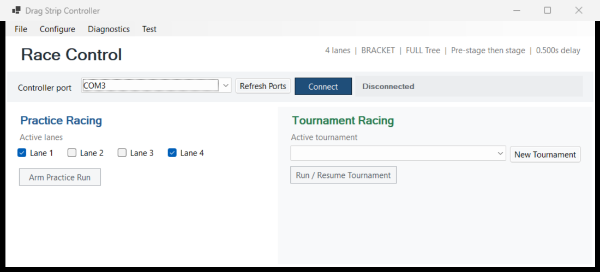

# Drag

Drag is an open-source slot-car drag timing and tournament-control system. An
Arduino Mega 2560 owns beam timing, Tree sequencing, and immediate race logic;
a .NET 10 Windows Forms application handles operator workflow, practice passes,
tournaments, reports, diagnostics, backups, and controller firmware updates.

> **Public beta source preview (`v0.05.0-beta.1`):** Drag is being shared for technical reference and
> careful bench evaluation. It has no production installation, and complete
> moving-car and four-lane validation is still in progress. Prebuilt DragWin
> application packages are not currently offered.

[](docs/images/dragwin-main.png)

## Capabilities

- Heads-up and bracket racing for two or four physical lanes.
- Full and Pro Tree timing with configurable staging behavior and staged delay.
- Practice passes, pass-result history, tournament setup, ordered lane choice,
  byes, advancement, and final standings.
- Four required beam sensors per lane plus two optional interval timers.
- Controller-maintained sensor edge counts and raw blocked-pulse durations.
- Cumulative interval, speed-trap, reaction, elapsed-time, speed, breakout,
  placement, foul, and DNF reporting.
- Local SQLite racer, car, tournament, pass, and settings storage.
- HTML reports with optional JSON and CSV exports.
- Verified manual restore, daily automatic backups, and pre-upgrade safety
  backups.
- Optional Windows SAPI or native Linux voice announcements, disabled by
  default.
- In-app installation of the bundled DragMC firmware through the Mega's normal
  USB bootloader.

## Validation Status

Lane 1 has four LM393 sensors wired and electrically validated. Sensor Test
reported every input, and cardboard beam interruptions completed multiple
end-to-end passes. A normal car has not yet completed that test because the
3/4-inch track deck leaves the present optical paths below the guide flag. The
planned correction is shallow routed mounting pockets, longer optical-component
leads, or both.

The two optional interval sensors per lane are implemented in firmware,
diagnostics, pass results, tournament history, and exports, but are not yet
installed at the track. Complete moving-car, four-lane, compatible-clone, and
production tournament validation remains pending.

See [Project Status](docs/PROJECT_STATUS.md) and [TODO](TODO.md) for the exact
completed and remaining work.

## Tested Platforms

| Environment | Verified result |
| --- | --- |
| Windows x64 | Primary development and physical-track environment |
| Wine 11 on Intel Linux | Self-contained x64 app, serial through `COM33`, automatic Windows avrdude download, and Mega firmware update |
| ARM64 Wine 11 on Rock 5B | Native Windows ARM64 DragWin through `COM1`, including Windows 32-bit avrdude download and successful Mega firmware update |

The ARM64 DragWin application ran without x64 CPU translation. The downloaded
uploader is the pinned Windows 32-bit `avrdude.exe`, which Wine also executed
successfully; DragWin does not invoke native Linux avrdude.

## Hardware Summary

- Controller: Arduino Mega 2560.
- Serial: USB serial at 115200 baud.
- Lanes: four, with two-lane mode using physical lanes 1 and 4.
- Required sensors: pre-stage, stage, speed trap, and finish in every lane.
- Optional sensors: Interval 1 and Interval 2 in each lane.
- Current LM393 polarity: active-HIGH, with 10k input pulldowns recommended.

The controller and sensor pin maps, wiring notes, optical-height limitation,
and Tree outputs are documented in [HARDWARE.md](HARDWARE.md).

## Repository Layout

```text
dragMC/                             Arduino Mega firmware
  dragMC.ino                        race and sensor controller
  FirmwareVersion.h                 controller firmware identity
  dist/                             matching DragMC firmware package

dragMCDueLightTest/                 Arduino Due Tree-output diagnostic
  dragMCDueLightTest.ino            light-test-only Due sketch

dragWin/                            .NET 10 Windows Forms application
  dragWin.sln                       solution
  dragWin.ProtocolTests/            lightweight integration test runner

docs/                               build, protocol, status, and operator notes
tools/Build-ControllerFirmware.ps1  reproducible Mega firmware packaging
```

The tracked `.dragfw` file is the controller image consumed and validated by a
DragWin source build. It is not a separately advertised application download.

## Build And Test

From the repository root on Windows:

```powershell
dotnet build dragWin\dragWin.sln -c Release
dotnet run --project dragWin\dragWin.ProtocolTests\dragWin.ProtocolTests.csproj -c Release
dotnet format dragWin\dragWin.sln --verify-no-changes --no-restore
arduino-cli compile --fqbn arduino:avr:mega:cpu=atmega2560 dragMC
```

The Windows application targets .NET 10. Visual Studio or the .NET SDK can
build it. See [Building From Source](docs/BUILDING.md) for firmware packaging,
local self-contained publishing, and clean-build expectations.

## Data And Privacy

DragWin writes its database, settings, serial logs, backups, and reports under
the operator's Windows profile and Documents folders. Those files are not part
of this repository. Racer names, car names, local paths, and serial activity can
appear in databases, reports, screenshots, and logs; remove private data before
sharing any diagnostic material.

## Documentation

- [Building from source](docs/BUILDING.md)
- [Current project status](docs/PROJECT_STATUS.md)
- [Hardware and wiring](HARDWARE.md)
- [Tournament behavior](docs/TOURNAMENTS.md)
- [Controller firmware updates](docs/CONTROLLER_FIRMWARE_UPDATE.md)
- [Linux speech under Wine](docs/LINUX_SPEECH.md)
- [Arduino Due light-tree diagnostic](dragMCDueLightTest/README.md)
- [Serial protocol](docs/SERIAL_PROTOCOL.md)
- [Troubleshooting](docs/TROUBLESHOOTING.md)
- [Engineering backlog](TODO.md)
- [Third-party notices](THIRD_PARTY_NOTICES.md)

The canonical repository is maintainer-controlled and is currently published
for reference rather than as a contribution or support venue. See
[CONTRIBUTING.md](CONTRIBUTING.md).

## License

Drag is licensed under the [MIT License](LICENSE).
